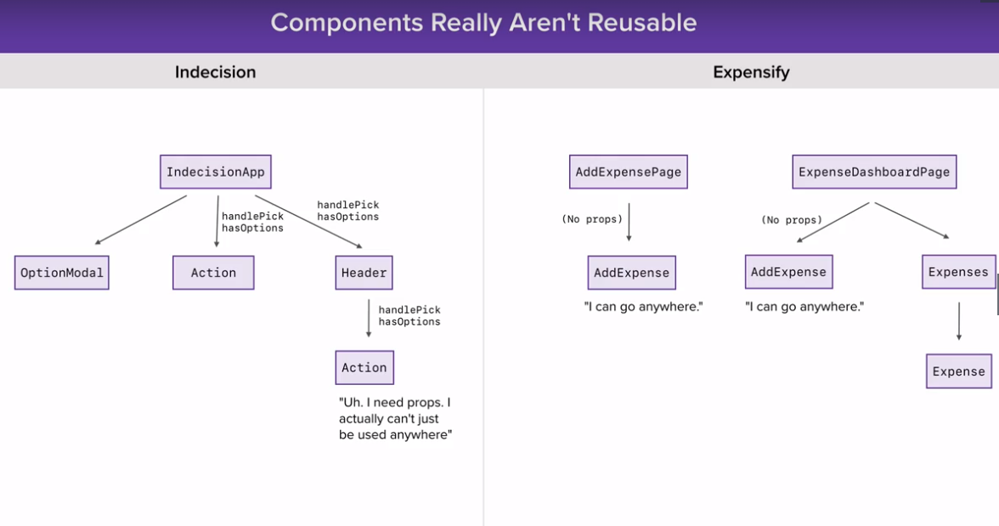
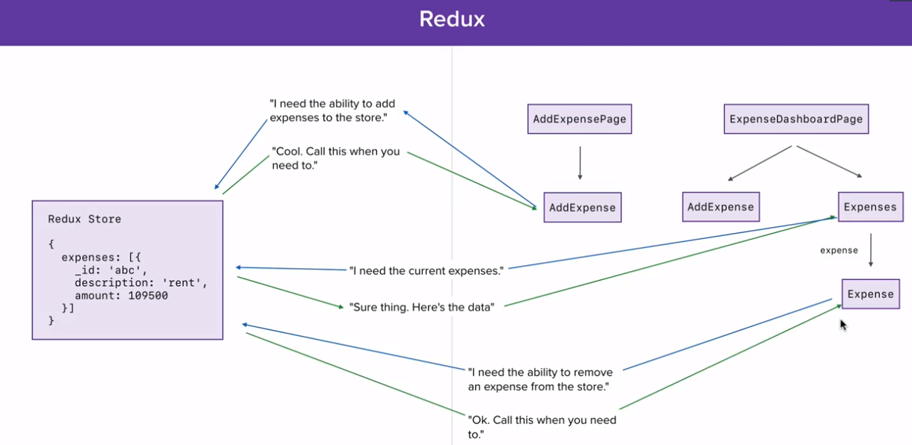

### Why redux?

- complext state  
  

- Component reusability is poor
  

- Using Redux  
  

- Action: object, describes the changes to be applied:

  ```js
  {
    type: INCREMENT;
    incrementBy: 5;
  }
  ```

- Reducer: function, describes how changes affect state
- 1. pure functions
- 2. never change state or action directly
  ```js
  const countReducer = (state = { count: 0 }, action) => {
    switch (action.type) {
      case "INCREMENT":
        return {
          count: state.count + action.incrementBy
        };
      case "DECREMENT":
        return {
          count: state.count - action.decrementBy
        };
      case "RESET":
        return {
          count: 0
        };
      case "SET":
        return {
          count: action.setTo
        };
      default:
        return state;
    }
  };
  ```
