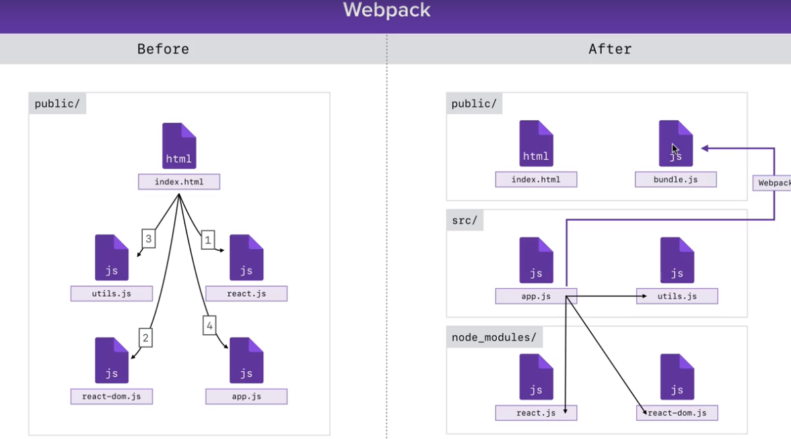

## Webpack



- `yarn add webpack@3.1.0`
- change package.json to:

```
"scripts": {
    "build": "webpack --watch",
    "dev": "babel src/app.js --out-file=public/scripts/app.js --presets=env,react --watch"
  },
```

- add `webpact.config.js` in root dir, in it:

  - specify entry point -> output
  - ```
    const path = require("path");

    module.exports = {
      entry: "./src/app.js",
      output: {
        path: path.join(__dirname, "public"),
        filename: "bundle.js"
      }
    };
    ```

- Configure webpact + babel
- `yarn add babel-core babel-loader`
- Set up loader in `webpack.config.js`

  ```js
  const path = require("path");

  module.exports = {
    entry: "./src/app.js",
    output: {
      path: path.join(__dirname, "public"),
      filename: "bundle.js"
    },
    module: {
      rules: [
        {
          loader: "babel-loader",
          test: /\.js$/,
          exclude: /node_modules/
        }
      ]
    }
  };
  ```

- configure babel to use `env` and `presets`
- in `.babelrc`:

  ```js
  {
    "presets": ["env", "react"]
  }

  ```

- config webpack source map to give better error message:

  ```js
  const path = require("path");

  module.exports = {
    entry: "./src/app.js",
    output: {
      path: path.join(__dirname, "public"),
      filename: "bundle.js"
    },
    module: {
      rules: [
        {
          loader: "babel-loader",
          test: /\.js$/,
          exclude: /node_modules/
        }
      ]
    },
    devtool: "cheap-module-eval-source-map"
  };
  ```

- install `webpack dev server`, use `devServer.contentBase`, this will tell us where to find public files

  ```js
  const path = require("path");

  module.exports = {
    entry: "./src/app.js",
    output: {
      path: path.join(__dirname, "public"),
      filename: "bundle.js"
    },
    module: {
      rules: [
        {
          loader: "babel-loader",
          test: /\.js$/,
          exclude: /node_modules/
        }
      ]
    },
    devtool: "cheap-module-eval-source-map",
    devServer: {
      contentBase: path.join(__dirname, "public")
    }
  };
  ```
